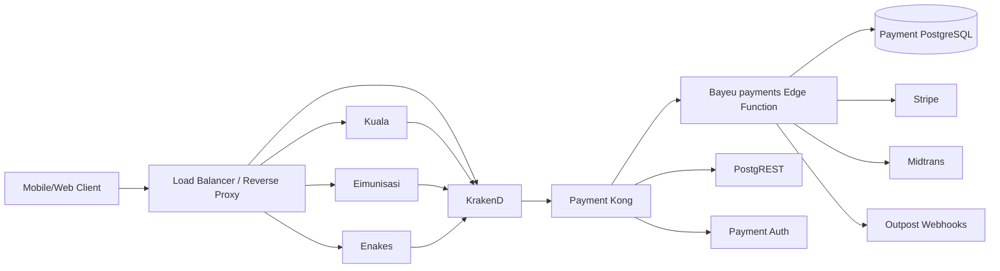

Other services should access Bayeu through a single internal API gateway, not by connecting directly to the payment containers or database.



Request Flow

A service should call:

```text
POST /payment/functions/v1/payments/initiate-payment
```

The request travels through:

```text
Kuala/Eimunisasi/Enakes
        -> KrakenD
        -> payment-kong:8000
        -> /functions/v1/payments/initiate-payment
        -> Bayeu payments function
        -> Payment database/gateway
```

The KrakenD mapping is defined in `ansible/roles/krakend/files/krakend/krakend.json`. Bayeu’s actual routes are defined in `submodules/bayeu/supabase/functions/payments/index.ts`.

Network Design

KrakenD is currently connected to:

- `backend`
- `payment_default`

This is necessary for KrakenD to resolve `payment-kong:8000`, as configured in `ansible/roles/krakend/files/krakend/docker-compose.yaml`.

Other application services should connect to KrakenD through the shared `backend` network. They should not be attached to `payment_default` unless they genuinely need direct access to payment infrastructure.

The payment database, Edge Function container, Kong, and internal Supabase services should remain private on `payment_default`.

Authentication

Use different credentials for different caller types:

1. End users
   - Authenticate through the identity service.
   - Receive a JWT.
   - Send the JWT as:

     ```http
     Authorization: Bearer <user-jwt>
     ```

   - Bayeu uses the JWT to identify the user and tenant.

2. Trusted backend services
   - Use a dedicated service-to-service credential.
   - Prefer a separate credential per service, such as:
     - `KUALA_PAYMENT_CLIENT`
     - `EIMUNISASI_PAYMENT_CLIENT`
     - `ENAKES_PAYMENT_CLIENT`
   - Do not share the Supabase `service_role` key between services.

3. Payment provider webhooks
   - Use a dedicated public webhook route.
   - Authenticate using Stripe or Midtrans webhook signatures.
   - Do not require a user JWT for provider callbacks.
   - Restrict webhook methods and paths to the specific provider route.

Important Current Security Gap

The current Kong `functions-v1` route has CORS enabled but does not apply `key-auth` or ACL:

```yaml
- name: functions-v1
  url: http://functions:9000/
  routes:
    - paths:
        - /functions/v1/
  plugins:
    - name: cors
```

Also, Bayeu’s `initiate-payment` handler accepts either `Authorization` or `apikey` and then decodes the JWT payload in `submodules/bayeu/supabase/functions/payments/handlers/initiatePayment.ts`. Decoding a JWT is not the same as verifying its signature.

The payment Edge Runtime can verify JWTs when:

```text
FUNCTIONS_VERIFY_JWT=true
```

because the main runtime checks `JWT_SECRET` in `ansible/roles/payment/files/payment/volumes/functions/main/index.ts`. This setting should be enabled for protected Bayeu endpoints.

However, webhook routes need a separate exception because Stripe and Midtrans do not send user JWTs. Those handlers must verify provider signatures themselves.

Recommended Controls

- Keep `payment-kong` and `payment-edge-functions` off the public host ports.
- Expose only KrakenD through the reverse proxy.
- Keep KrakenD on `backend` and `payment_default`.
- Keep application services on `backend`, without direct payment-network access.
- Enable `FUNCTIONS_VERIFY_JWT=true`.
- Add Kong `key-auth` and ACL enforcement to protected function routes, or enforce equivalent authentication in KrakenD.
- Use separate service credentials with least privilege.
- Never pass `SUPABASE_SERVICE_ROLE_KEY` to mobile or frontend clients.
- Validate `tenant_id` against the authenticated caller’s allowed tenants.
- Verify Stripe/Midtrans signatures on webhook routes.
- Apply rate limits and request-size limits at KrakenD or Kong.
- Use HTTPS at the external reverse proxy.
- Do not expose payment PostgreSQL or PostgREST directly to other services.
- Log request IDs, caller identity, tenant ID, route, and outcome, but never payment secrets or full authorization headers.

The key principle is:

```text
Services may call the payment API.
Services may not call the payment database.
```

The current structure already has the right broad shape with KrakenD and Kong, but JWT verification and service-to-service authorization need to be enforced explicitly before considering the architecture secure.
